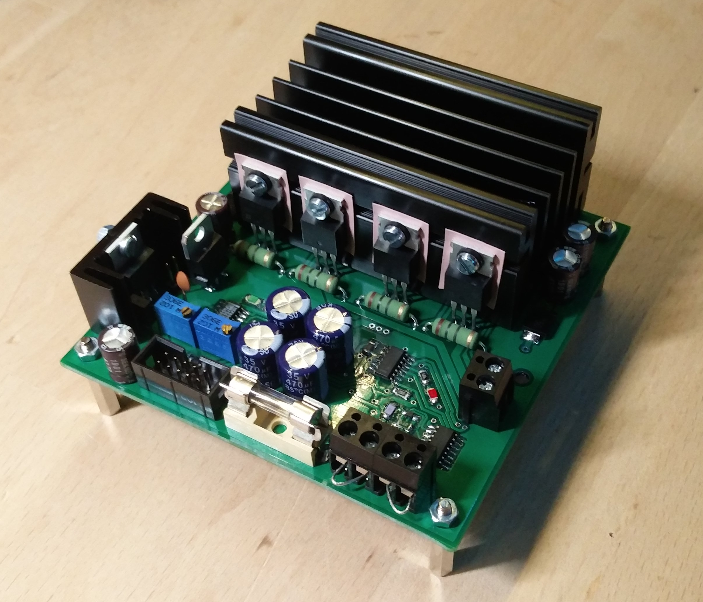
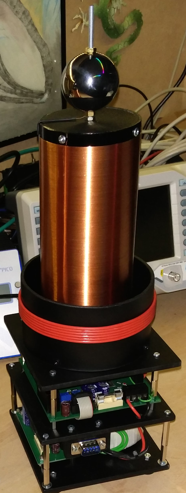

# simpleTeslaCoil
just a simple TeslaCoil (SSTC) with basic components

<ins>Few facts:</ins>
- 12-24V input voltage
- around 3-4A current maximum
- up to 550kHz frequency possible
- 100x100mm board

Picture of the finished board:

And a picture of my final construction with coil and PSU:

